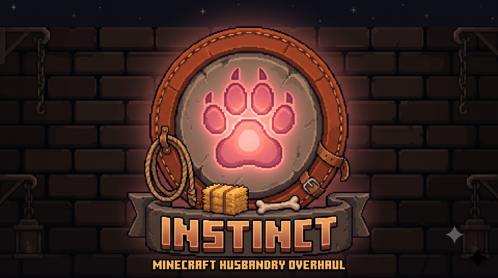

<p align="center">
  
</p>

<p align="center"><strong>Worth raising.</strong></p>

<p align="center">Instinct — husbandry overhaul</p>

<p align="center">
  <a href="https://www.minecraft.net/"></a>
  <a href="https://fabricmc.net/"></a>
  <a href="LICENSE"></a>
</p>

Instinct is in development. The player-experience promise lives in
[`design/VISION.md`](design/VISION.md); this page will describe features as they ship.
The foundations are in place: the server config (`config/instinct.json`, hot-reloaded
with `/instinct reload`), the pets/livestock animal-coverage resolution
(config → `#instinct:*` tags → tamable/breedable heuristic — a modded animal that
lives like a vanilla one is covered automatically, and a datapack or server owner
can override any species), and the persistent per-animal data every feature rides on.
`/instinct info` reports how the animal on your crosshair resolved.

---

## For Mod Developers

Instinct exposes a stable, read-only API in `com.rfizzle.instinct.api`, following the
[Concord API Standard](https://github.com/rfizzle/concord/blob/master/API-STANDARD.md).
Use it as a soft dependency: compile against the mod with `modCompileOnly` and guard
every call with `FabricLoader.isModLoaded("instinct")`. Everything outside the `api`
package is internal and may change in any release.

**The stable surface**

- `InstinctAPI.isPet(EntityType<?>)` / `InstinctAPI.isLivestock(EntityType<?>)` —
  set membership after full Animal Coverage resolution
- `InstinctAPI.getGrade(Animal)` / `InstinctAPI.getPerk(Animal)` — bloodline grade
  and birth perk (`ORDINARY`/`NONE` for untracked animals)
- `InstinctAPI.getVeterancyDays(TamableAnimal)` / `InstinctAPI.getVeterancyRank(TamableAnimal)` —
  accrued days and derived rank 0–3
- `InstinctAPI.isDowned(LivingEntity)` — downed state
- `InstinctAPI.isTroughFed(Animal)` — trough-fed within the last 24000 ticks

An animal mod needs **no code at all** to opt in or out: ship entries in the
`#instinct:pets`, `#instinct:pets_exclude`, `#instinct:livestock`, or
`#instinct:livestock_exclude` entity-type tags (and `#instinct:trough_food` /
`#instinct:revive_items` item tags) in your own data.

### Gradle Setup

```gradle
dependencies {
    modCompileOnly "maven.modrinth:instinct:<version>"
}
```

### Usage Example

```java
if (FabricLoader.getInstance().isModLoaded("instinct")) {
    boolean livestock = com.rfizzle.instinct.api.InstinctAPI.isLivestock(EntityType.COW);
}
```

---

## Part of Concord

Part of [Concord](https://github.com/rfizzle/concord) — a modular collection of system overhauls.
Install any, combine all.

---

## License

Licensed under the [MIT License](LICENSE). © 2026 rfizzle. Instinct is not
affiliated with Mojang Studios or Microsoft.
